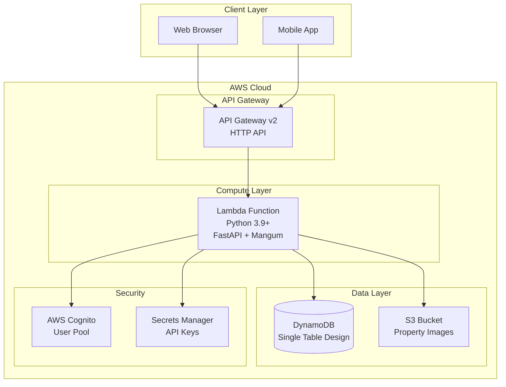
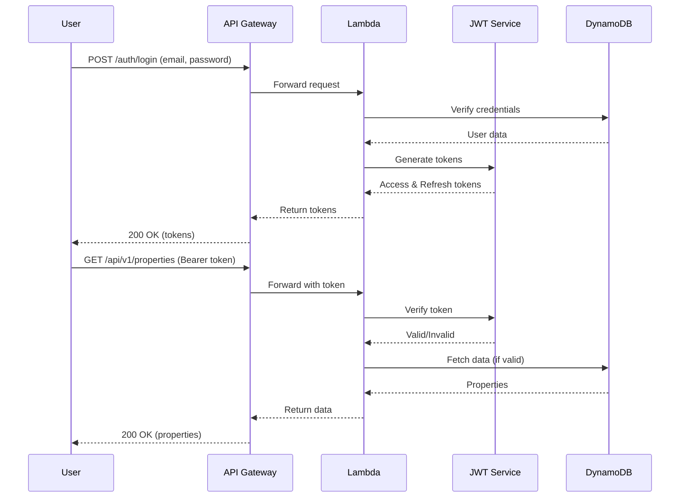
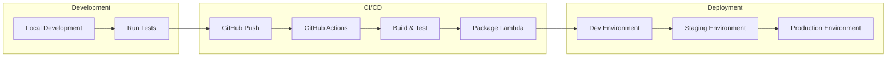

# Backend Architecture

## System Architecture



## API Structure

```
/
├── /health                    # Health check (no auth)
├── /api/v1/
│   ├── /auth/
│   │   ├── POST /register    # User registration
│   │   ├── POST /login       # User login
│   │   └── POST /refresh     # Token refresh
│   ├── /users/
│   │   ├── GET /me          # Get current user
│   │   └── PUT /me          # Update profile
│   ├── /properties/
│   │   ├── GET /            # List properties
│   │   ├── POST /           # Create property
│   │   ├── GET /{id}        # Get property
│   │   ├── PUT /{id}        # Update property
│   │   └── DELETE /{id}     # Delete property
│   └── /inquiries/
│       ├── GET /            # List inquiries
│       ├── POST /           # Create inquiry
│       └── PUT /{id}        # Update inquiry
```

## DynamoDB Single Table Design

### Primary Table Structure

| Attribute | Type | Description |
|-----------|------|-------------|
| PK | String | Partition Key |
| SK | String | Sort Key |
| GSI1PK | String | GSI1 Partition Key |
| GSI1SK | String | GSI1 Sort Key |
| EntityType | String | Entity type identifier |
| CreatedAt | String | ISO 8601 timestamp |
| UpdatedAt | String | ISO 8601 timestamp |

### Entity Patterns

#### User Entity
```
PK: USER#<userId>
SK: PROFILE
Attributes:
  - email
  - name
  - phoneNumber
  - userType (buyer/seller/agent)
  - verified
  - createdAt
  - updatedAt
```

#### Property Entity
```
PK: PROPERTY#<propertyId>
SK: DETAILS
Attributes:
  - title
  - description
  - price
  - bedrooms
  - bathrooms
  - squareFeet
  - address
  - city
  - state
  - zipCode
  - status (active/pending/sold)
  - userId (owner)
  - images[]
  - features[]
  - createdAt
  - updatedAt

GSI1PK: USER#<userId>
GSI1SK: PROPERTY#<createdAt>
```

#### Inquiry Entity
```
PK: INQUIRY#<inquiryId>
SK: DETAILS
Attributes:
  - propertyId
  - userId (inquirer)
  - message
  - status (new/responded/closed)
  - createdAt
  - updatedAt

GSI1PK: PROPERTY#<propertyId>
GSI1SK: INQUIRY#<createdAt>
```

### Access Patterns

1. **Get user by ID**: Query PK=USER#{userId}, SK=PROFILE
2. **Get user by email**: GSI on email attribute
3. **List properties by user**: Query GSI1 where GSI1PK=USER#{userId}
4. **Get property details**: Query PK=PROPERTY#{propertyId}, SK=DETAILS
5. **List inquiries for property**: Query GSI1 where GSI1PK=PROPERTY#{propertyId}
6. **List all active properties**: GSI on status attribute or scan with filter

## Security Architecture

### Authentication Flow



### Security Measures

1. **JWT Authentication**
   - Access tokens (30 min expiry)
   - Refresh tokens (7 days expiry)
   - RS256 algorithm for production

2. **Password Security**
   - Bcrypt hashing
   - Minimum 8 characters
   - Complexity requirements

3. **API Security**
   - Rate limiting via API Gateway
   - CORS configuration
   - Input validation via Pydantic

4. **Data Security**
   - Encryption at rest (DynamoDB)
   - Encryption in transit (HTTPS)
   - IAM roles for Lambda

## Deployment Architecture

### Infrastructure as Code

```yaml
# serverless.yml example
service: lifestyle-spaces-api

provider:
  name: aws
  runtime: python3.9
  region: us-east-1
  environment:
    DYNAMODB_TABLE: ${self:service}-${opt:stage, 'dev'}
    JWT_SECRET_KEY: ${ssm:/lifestyle-spaces/jwt-secret}

functions:
  api:
    handler: lambda_handler.handler
    events:
      - httpApi: '*'
    environment:
      ENVIRONMENT: ${opt:stage, 'dev'}

resources:
  Resources:
    DynamoDBTable:
      Type: AWS::DynamoDB::Table
      Properties:
        TableName: ${self:provider.environment.DYNAMODB_TABLE}
        BillingMode: PAY_PER_REQUEST
        # ... table schema
```

### CI/CD Pipeline



## Performance Optimization

### Caching Strategy

1. **Lambda Container Reuse**
   - Global variables for DB connections
   - Singleton pattern for clients

2. **DynamoDB Optimization**
   - Single table design
   - Composite keys for efficient queries
   - GSIs for access patterns

3. **API Response Caching**
   - CloudFront for static assets
   - API Gateway caching for GET requests

### Monitoring & Observability

1. **CloudWatch Metrics**
   - Lambda invocations
   - API Gateway requests
   - DynamoDB throttling

2. **X-Ray Tracing**
   - End-to-end request tracing
   - Performance bottleneck identification

3. **Custom Metrics**
   - Business metrics
   - Error rates by endpoint
   - User activity patterns

## Scaling Considerations

### Current Design (MVP)
- Single Lambda function
- Single DynamoDB table
- Synchronous processing

### Future Scaling Options

1. **Horizontal Scaling**
   - Lambda concurrent executions (1000 default)
   - DynamoDB auto-scaling
   - API Gateway throttling

2. **Vertical Scaling**
   - Lambda memory/CPU allocation
   - DynamoDB provisioned capacity

3. **Architectural Evolution**
   - Microservices separation
   - Event-driven with SQS/SNS
   - Read replicas for analytics

## Cost Optimization

### Pay-per-use Services
- Lambda: Pay per invocation + duration
- DynamoDB: Pay per request
- API Gateway: Pay per request
- S3: Pay for storage + transfer

### Cost Estimates (Monthly)
```
Development Environment:
- Lambda: ~$0 (free tier)
- DynamoDB: ~$0 (free tier)
- API Gateway: ~$0 (free tier)

Production (10K users, 100K requests/day):
- Lambda: ~$20-50
- DynamoDB: ~$25-50
- API Gateway: ~$35
- Total: ~$80-135/month
```

## Technology Stack

| Component | Technology | Rationale |
|-----------|------------|-----------|
| Runtime | Python 3.9+ | Modern, good AWS support |
| Framework | FastAPI | Fast, modern, automatic docs |
| Lambda Adapter | Mangum | Seamless FastAPI-Lambda integration |
| Database | DynamoDB | Serverless, scalable, cost-effective |
| Authentication | JWT | Stateless, scalable |
| Testing | pytest | Comprehensive, good coverage tools |
| Validation | Pydantic | Type safety, automatic validation |
| Password Hashing | bcrypt | Industry standard, secure |